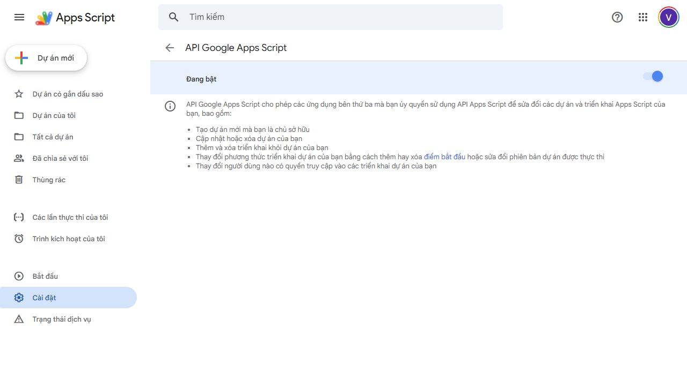
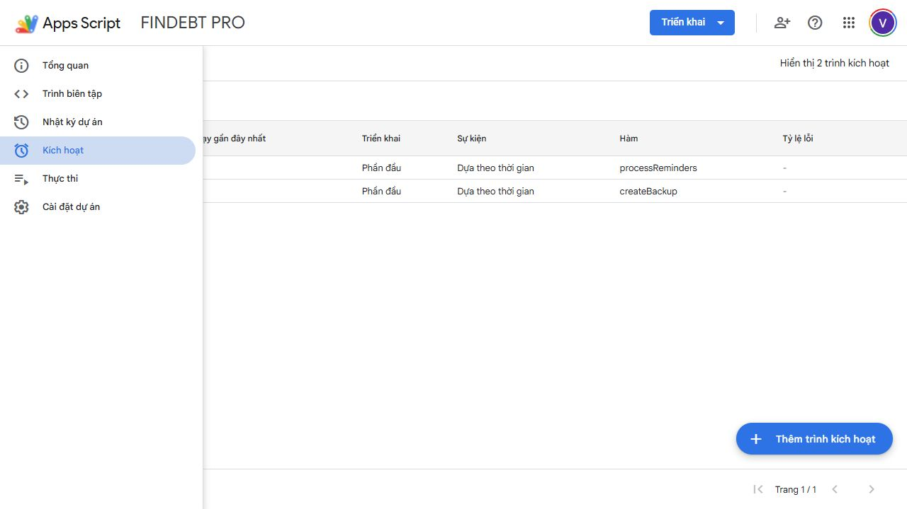

# Hướng dẫn quản trị và triển khai FINDEBT PRO

## 1. Tài khoản sở hữu

Người quản trị nên dùng một tài khoản doanh nghiệp ổn định, bật xác thực hai bước và không chia sẻ refresh token/clasp credentials.

## 2. Bật Apps Script API

Mở `https://script.google.com/home/usersettings`, chọn đúng Google account và bật **Google Apps Script API**.



Quyền này cho phép clasp tạo/cập nhật project và deployment. Không commit `.clasprc.json` hoặc OAuth token vào GitHub.

## 3. Cấp OAuth runtime

Trong Apps Script editor:

1. Chọn `Code.gs`.
2. Chọn hàm `doGet` rồi **Run / Chạy**.
3. Chọn **Review permissions**.
4. Chọn tài khoản sở hữu project.
5. Đọc scope rồi chọn **Allow**.

Chỉ bỏ qua cảnh báo “unverified” với project do chính doanh nghiệp sở hữu và khi URL vẫn thuộc Google.

## 4. Deployment production

Trong **Deploy → Manage deployments**, kiểm tra:

- Type: Web app.
- Version: version production mới nhất.
- Execute as: **User accessing the web app**.
- Access: bất cứ ai có Google Account, hoặc giới hạn domain theo chính sách doanh nghiệp.

Trước khi deploy, kiểm tra Apps Script project có đủ năm file build: `appsscript.json`, `Bundle.js`, `Client.html`, `Code.gs` và `Index.html`. Deployment production hiện tại của dự án mẫu là `@42`; khi cập nhật phải giữ nguyên deployment ID để người dùng không phải đổi URL.

URL production:

`https://script.google.com/macros/s/AKfycbzPMDvCufvzEEzwXh5gTX6qQLyEYWzxrCzpFdn4LU1HpgivOmlpn-VxZK6dx5T_ln8C/exec`

Tuyệt đối không chọn **User deploying** cho production nhiều người. Sau khi cập nhật deployment cũ, mở bằng một tài khoản Google khác và xác nhận wizard xuất hiện thay vì dữ liệu của chủ app.

## 5. Khởi tạo datastore

Mở Web App và chọn **Tạo workspace mới**. FINDEBT tạo một thư mục gốc, cây thư mục đánh số, Google Sheet Data Console, schema version 4, manifest và User Properties liên kết. Khi gặp workspace cấu trúc cũ, lần mở đầu của chủ dữ liệu sẽ tái sử dụng thư mục `FINDEBT_PRO`, chuyển nội dung `BACKUPS`/`REPORTS` vào nhánh mới và chuyển Sheet vào `01_DATA`; dữ liệu tài chính không bị xóa.

Không đổi tên hoặc di chuyển riêng Sheet ra khỏi thư mục gốc. Nếu User Properties bị mất, dùng **Liên kết workspace** với link thư mục gốc để phục hồi con trỏ từ manifest.

## 6. Trigger tự động

Production phải có hai trigger time-driven:

- `processReminders`: hằng ngày khoảng 08:00.
- `createBackup`: hằng ngày khoảng 02:00.



Theo dõi tỷ lệ lỗi trong trang **Triggers** và chi tiết lỗi trong **Executions**. Apps Script có thể chạy lệch vài phút so với giờ cấu hình.

## 7. Quy trình phát hành phiên bản mới

```powershell
npm run check
npm run push
npx clasp deploy -i AKfycbzPMDvCufvzEEzwXh5gTX6qQLyEYWzxrCzpFdn4LU1HpgivOmlpn-VxZK6dx5T_ln8C -d "FINDEBT PRO release"
npm run smoke:production
```

Với deployment ổn định, ưu tiên `clasp redeploy` vào deployment ID hiện tại để URL không đổi. Trước mỗi release:

1. Tạo backup thủ công.
2. Chạy critical accounting tests.
3. Kiểm tra manifest scopes.
4. Push GitHub.
5. Deploy version mới.
6. Smoke test dashboard, partial payment, VietQR, PDF và backup.

## 8. Bảo mật vận hành

- Không đưa `.clasp.json`, `.clasprc.json`, credentials hay token lên GitHub.
- Không chia sẻ quyền sửa Google Sheet rộng hơn nhu cầu.
- Không hard delete giao dịch tài chính.
- Review audit log khi phát hiện chênh lệch.
- Kiểm tra MailApp quota trước khi nhập lượng lớn khách hàng có bật reminder.
- Thử restore trên bản dữ liệu thử trước khi dùng với production.
- Chỉ thêm thành viên trong màn hình Cài đặt để quyền Drive và vai trò server luôn đồng bộ.
- Không chia sẻ thư mục bằng chế độ “Anyone with the link”.

## 9. Vận hành cache và kiểm tra hiệu năng

- Bootstrap cache tồn tại tối đa 120 giây nhưng khóa theo `DATA_VERSION`; các thao tác ghi nghiệp vụ tự tăng phiên bản và làm snapshot cũ hết hiệu lực.
- Health workspace cache tối đa 5 phút. Nút **Kiểm tra lại** có thể vẫn dùng kết quả trong cửa sổ này; mutation thành viên hoặc dữ liệu sẽ đổi phiên bản và tạo khóa health mới.
- `01_TỔNG_QUAN`, `02_CÔNG_NỢ` và trạng thái tại `00_BẮT_ĐẦU` không chặn lúc mở app. Owner/Admin/Kế toán đồng bộ ở nền sau bootstrap, sau mutation hoặc khi bấm **Đồng bộ Data Console**.
- Schema 4 tự đổi tên tab staging cũ, tạo các tab người dùng được đánh số, bổ sung hồ sơ doanh nghiệp/logo, ẩn hoặc bảo vệ bảng hệ thống và giữ nguyên dữ liệu cũ. Không chia sẻ trực tiếp các tab hệ thống; quản lý thành viên từ Web App.
- Số `bootstrap ms`, trạng thái cache và data version hiển thị trong Dashboard/Cài đặt để hỗ trợ chẩn đoán; không chứa nội dung tài chính trong log trình duyệt.
- Khi health báo quyền Drive không khớp, chỉ chỉnh thành viên qua FINDEBT để đồng bộ vai trò server và editor/viewer của thư mục gốc.
