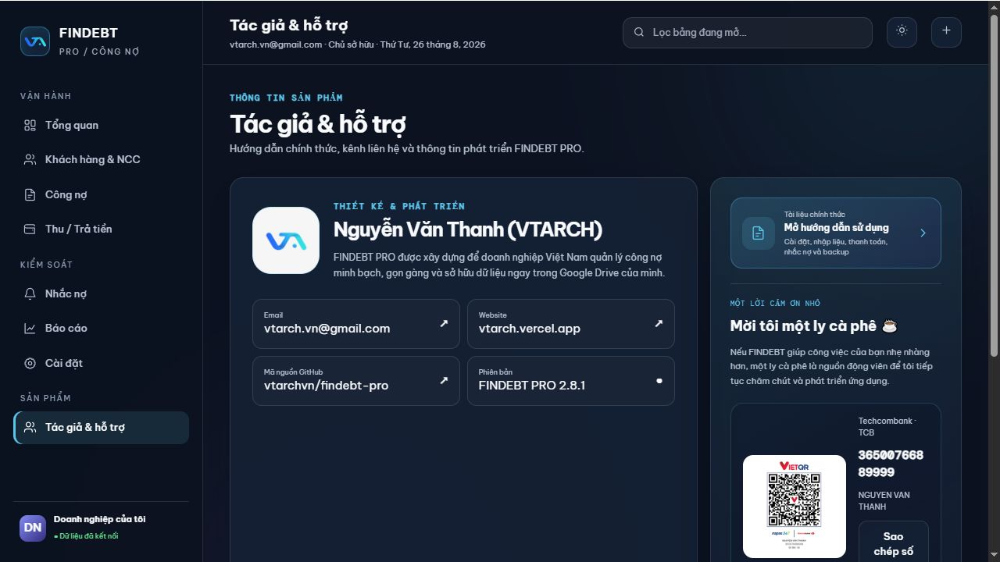
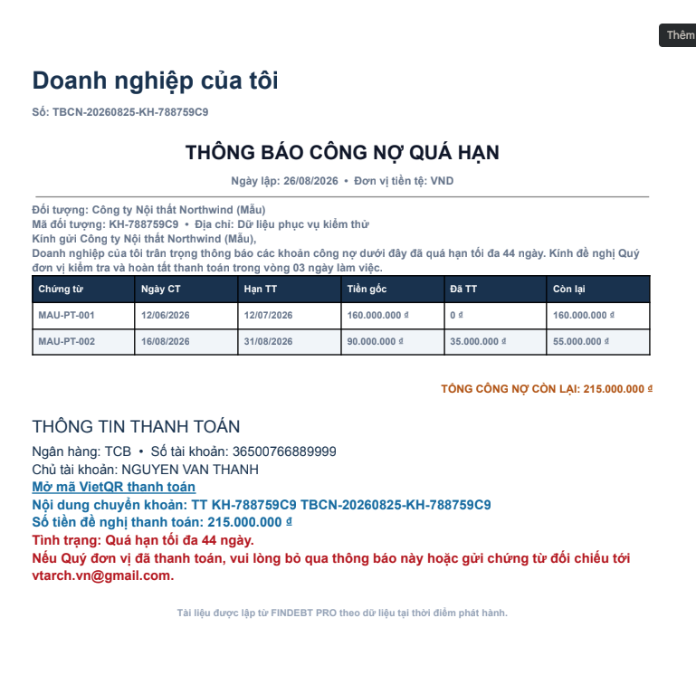
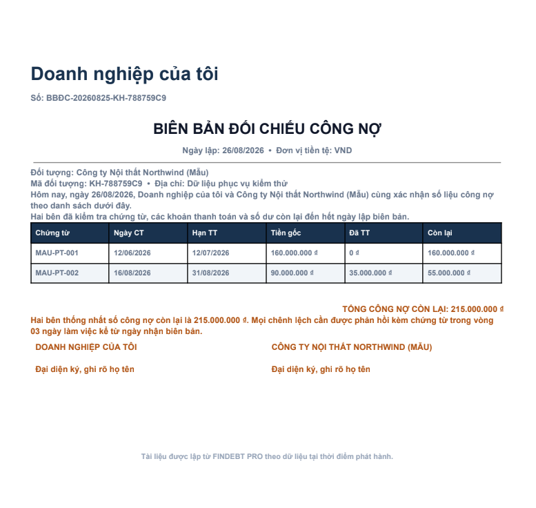
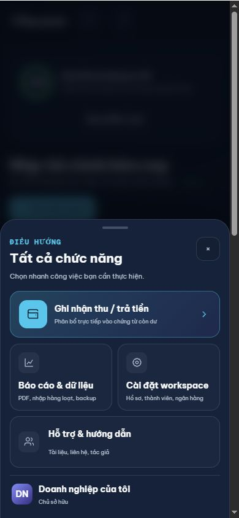

# Hướng dẫn sử dụng FINDEBT PRO

> **Luôn xem bản mới nhất:** [github.com/vtarchvn/findebt-pro/blob/main/docs/USER_GUIDE.md](https://github.com/vtarchvn/findebt-pro/blob/main/docs/USER_GUIDE.md)

> **Phạm vi tài liệu:** đã đối chiếu trực tiếp với FINDEBT PRO 2.8.1 · deployment `@42` ngày 26/08/2026. Chỉ các ảnh còn khớp giao diện hiện tại mới được giữ lại; dữ liệu minh họa không phải dữ liệu tài chính thật.

## Tác giả và hỗ trợ

Mở `Tác giả & hỗ trợ` ở thanh điều hướng máy tính hoặc chọn `Thêm → Hỗ trợ & hướng dẫn` trên điện thoại. Nút **Mở hướng dẫn sử dụng** dẫn thẳng tới bản tài liệu mới nhất trên GitHub; cùng trang này còn có email, website, mã nguồn và phiên bản đang dùng. Nếu muốn mời tác giả một ly cà phê, quét VietQR hoặc sao chép số tài khoản Techcombank hiển thị ngay trong tab; QR không đặt trước số tiền.

_Trang hỗ trợ tập trung tài liệu chính thức, kênh liên hệ, mã nguồn, phiên bản ứng dụng và VietQR ủng hộ tác giả._

Tài liệu này dành cho kế toán, chủ doanh nghiệp và người theo dõi công nợ. Ảnh minh họa dùng dữ liệu mẫu; dữ liệu thật được lưu riêng trong Google Sheets của tài khoản triển khai.

## 1. Mở ứng dụng và cấp quyền

1. Đăng nhập tài khoản Google được phép sử dụng FINDEBT.
2. Mở [FINDEBT PRO production](https://script.google.com/macros/s/AKfycbzPMDvCufvzEEzwXh5gTX6qQLyEYWzxrCzpFdn4LU1HpgivOmlpn-VxZK6dx5T_ln8C/exec).
3. Trong lần mở đầu, Google có thể hiển thị **Authorization required**.
4. Chọn **Review permissions / Xem lại quyền**, chọn đúng tài khoản Google.
5. Nếu Google ghi ứng dụng chưa được xác minh, chọn **Advanced / Nâng cao** → **Go to FINDEBT PRO**. Chỉ thực hiện khi URL thuộc `script.google.com` và project do doanh nghiệp sở hữu.
6. Đọc danh sách quyền rồi chọn **Allow / Cho phép**. FINDEBT chạy bằng chính tài khoản đang truy cập và cần Sheets để lưu dữ liệu, Drive để tạo PDF/backup, Mail để gửi nhắc nợ và Script Triggers để chạy lịch tự động.
7. Chọn **Tạo workspace mới** hoặc dán link thư mục gốc đã được chủ doanh nghiệp chia sẻ. Ứng dụng không tự tạo Sheet trước khi bạn chọn.

Khi tạo mới, giữ trang mở và theo dõi bốn giai đoạn: xác nhận tài khoản, tạo cấu trúc thư mục, tạo Google Sheet Console và hoàn tất quyền Owner. Sau khi đạt 100%, FINDEBT giữ màn hình kết quả để bạn có thể mở thử **thư mục Drive** và **Google Sheet** trước khi chọn **Vào FINDEBT**.

Mỗi workspace nằm trong một thư mục `FINDEBT_PRO — Tên doanh nghiệp`. Người có URL Web App nhưng không có quyền Drive và không có tên trong bảng thành viên sẽ không đọc được dữ liệu của workspace.

Nếu trình duyệt đăng nhập nhiều Google account và hiện “Không tìm thấy trang”, mở URL bằng cửa sổ ẩn danh hoặc Chrome profile chỉ đăng nhập tài khoản cần dùng. Đây là giới hạn chọn profile của Google Apps Script, không phải lỗi mất deployment.

## 2. Đọc Dashboard

_Dashboard mới có dải kiểm tra sức khỏe workspace, nhóm hành động nhanh, bốn KPI chính, biểu đồ tuổi nợ và danh sách quá hạn ưu tiên. Logo VTARCH ở thanh bên là nhận diện mới của ứng dụng._

Dashboard hiển thị:

- **Phải thu:** tổng outstanding của chứng từ phải thu.
- **Phải trả:** tổng outstanding của chứng từ phải trả.
- **Công nợ ròng:** phải thu trừ phải trả.
- **Nợ quá hạn:** outstanding của các chứng từ đã qua hạn.
- **Tuổi nợ:** trong hạn, 1–30 ngày, 31–60 ngày và trên 60 ngày.
- **Quá hạn ưu tiên:** các khoản cần liên hệ trước.
- **Sắp đến hạn:** khoản đến hạn trong 7 ngày.
- **Khách hẹn thanh toán:** lời hẹn hôm nay, sắp tới hoặc đã trễ.

Mọi số liệu được tính phía máy chủ. Không nhập trạng thái thanh toán bằng tay.

## 3. Tạo khách hàng hoặc nhà cung cấp

Mở **Khách hàng & NCC** trên máy tính hoặc **Đối tác** trên điện thoại để tìm và quản lý khách hàng/nhà cung cấp. Chọn **Thêm khách hàng / NCC**, sau đó nhập:

_Danh sách có ô tìm kiếm, bộ lọc phân loại, hạn mức và trạng thái nhắc nợ của từng hồ sơ._

_Biểu mẫu tạo hồ sơ mới; các trường bắt buộc được đánh dấu bằng dấu `*`._

- Tên và phân loại khách hàng/NCC.
- Số điện thoại, email và địa chỉ.
- Hạn mức tín dụng đối với khách hàng.
- Thời hạn nợ chuẩn, ví dụ 30 ngày.
- Chỉ bật **Cho phép nhắc nợ** khi email đã được kiểm tra.

Nếu có số dư đầu kỳ, hệ thống tự tạo chứng từ `DAU-KY` để số dư tham gia dashboard, aging và thanh toán giống chứng từ bình thường.

## 4. Tạo chứng từ công nợ

Mở **Công nợ** để xem Sổ công nợ phải thu và phải trả. Màn hình tải tối đa 40 dòng mỗi lần và có các công cụ:

_Chọn một dòng để xem chi tiết, số còn lại, hạn thanh toán và các hành động Thu/trả tiền hoặc VietQR._

- Tìm theo số chứng từ hoặc tên khách hàng/NCC.
- Lọc **Tất cả**, **Còn nợ**, **Quá hạn** hoặc **Đã trả**.
- Lọc riêng phải thu/phải trả và sắp xếp theo ngày mới nhất, hạn gần nhất hoặc dư nợ lớn nhất.
- Chọn một dòng để mở panel chi tiết; từ đây có thể ghi nhận thu/trả tiền hoặc tạo VietQR.

Chọn **Thêm chứng từ**:

1. Chọn khách hàng hoặc nhà cung cấp.
2. Chọn **Phải thu** cho bán nợ hoặc **Phải trả** cho mua nợ/NCC.
3. Nhập số chứng từ và số tiền nguyên VND.
4. Nhập ngày chứng từ và hạn thanh toán.
5. Kiểm tra cảnh báo hạn mức trước khi tiếp tục giao dịch bán nợ.

Outstanding được tính theo công thức `Tiền gốc − Tổng thanh toán đã phân bổ còn hiệu lực`.

## 5. Ghi nhận thu hoặc trả tiền

Từ panel chi tiết chứng từ, chọn **Thu / trả tiền**; hoặc chọn **Thu tiền nhanh** trên Dashboard. Trên điện thoại, mở **Thêm → Ghi nhận thu / trả tiền**.

_Chọn đúng khách hàng/NCC và loại giao dịch trước; danh sách chứng từ sẽ được lọc theo lựa chọn đó._

1. Chọn thu tiền hoặc trả tiền NCC.
2. Nhập ngày, số tiền, phương thức và tham chiếu ngân hàng.
3. Chọn chứng từ cần phân bổ.
4. Kiểm tra số tiền không vượt outstanding.
5. Lưu giao dịch.

Một chứng từ có thể nhận nhiều lần thanh toán. Backend cũng hỗ trợ một khoản thanh toán phân bổ cho nhiều chứng từ. Không xóa trực tiếp giao dịch tài chính; dùng **Void/Hủy** để audit log vẫn giữ lịch sử.

Ví dụ kiểm tra chuẩn:

- Hóa đơn: 100.000.000₫.
- Thu lần một: 30.000.000₫.
- Outstanding mới: 70.000.000₫.
- Thu tiếp: 70.000.000₫.
- Outstanding bằng 0, trạng thái chuyển thành **Đã thanh toán** và dừng aging/reminder/VietQR.

## 6. Thu tiền bằng VietQR

Với chứng từ phải thu còn dư, chọn biểu tượng QR trên dòng chứng từ. QR luôn lấy **outstanding mới nhất**, không dùng lại giá trị hóa đơn ban đầu.

Nội dung chuyển khoản có dạng `FIN {Mã đối tượng} {Mã chứng từ}`. Sau khi nhận tiền, kế toán vẫn phải ghi nhận thanh toán và phân bổ để đóng công nợ.

## 7. Nhắc nợ và lời hẹn thanh toán

_Màn hình cho biết lời hẹn hôm nay, sắp tới, đã trễ và các nguyên tắc an toàn trước khi bật trigger hằng ngày._

Lịch mặc định: T−3, T, T+3, T+7, T+14, T+30, sau đó 7 ngày/lần. Hệ thống kiểm tra lại outstanding ngay trước khi gửi và không gửi nếu:

- Công nợ đã thanh toán đủ.
- Reminder key đã được gửi.
- Khách đang có Promise to Pay chưa đến hạn.
- Đối tượng tắt nhắc nợ hoặc không có email.

Khi khách cam kết thanh toán, chọn **Thêm lời hẹn**, nhập ngày/số tiền và chứng từ. Dashboard sẽ phân loại hẹn hôm nay, sắp tới hoặc đã trễ.

Trong giai đoạn nhập dữ liệu thử, để trống email hoặc tắt **Cho phép nhắc nợ** nhằm tránh gửi email thật.

## 8. Báo cáo, PDF, import/export và backup

_Trung tâm dữ liệu mới gom mở Google Sheet/Drive, nhập hàng loạt có kiểm tra, backup, nhân bản workspace và xuất phiếu vào cùng một màn hình._

- **Thư đề nghị thanh toán:** dùng để gửi khách hàng, kèm các khoản còn nợ, thông tin ngân hàng và nội dung chuyển khoản.
- **Biên bản đối chiếu công nợ:** dùng để hai bên xác nhận số liệu và ký tại một thời điểm.
- **Export CSV:** xuất đối tượng, chứng từ hoặc thanh toán; file có BOM để Excel đọc tiếng Việt.
- **Import CSV:** chọn loại dữ liệu và file tối đa 2 MB. Bước **Kiểm tra file** chỉ xem trước; chỉ nút **Xác nhận nhập** mới ghi dữ liệu. Nếu một dòng lỗi, cả đợt bị chặn.
- **Import từ Sheet:** dán hàng loạt vào `03_NHẬP_ĐỐI_TƯỢNG` hoặc `04_NHẬP_CHỨNG_TỪ`, sửa các ô được báo lỗi, đánh dấu cột **Sẵn sàng nhập**, sau đó chọn **Nhập các dòng đã chọn** trên Web App. Kết quả gần nhất nằm tại `05_KẾT_QUẢ_NHẬP`.
- **Xem tổng thể:** dùng `01_TỔNG_QUAN` cho KPI/cảnh báo và `02_CÔNG_NỢ` để lọc công nợ. Sau khi ghi dữ liệu trên app, hệ thống tự đồng bộ các bảng này ở nền; cũng có thể bấm **Đồng bộ Data Console** trong Cài đặt.
- **Backup ngay:** tạo bản sao Google Sheet trong `05_BACKUPS`.
- **Khôi phục:** luôn tạo thêm bản `BEFORE_RESTORE` trước khi ghi đè dữ liệu hiện tại.
- **Nhân bản workspace:** Owner có thể tạo mẫu trống, bản sao đầy đủ hoặc snapshot chỉ đọc. Mọi bản sao có workspace ID mới và tắt reminder mặc định.

Hai loại tài liệu PDF hiện được trình bày riêng theo đúng mục đích sử dụng:

_**Thư đề nghị thanh toán** dùng để gửi khách hàng: nêu khoản quá hạn, tổng tiền cần thanh toán, thông tin ngân hàng và nội dung chuyển khoản._

_**Biên bản đối chiếu công nợ** dùng để hai bên xác nhận số liệu tại một thời điểm, có khu vực đại diện hai doanh nghiệp ký và ghi rõ họ tên._

Không khôi phục backup khi người khác đang nhập giao dịch. Nên thực hiện ngoài giờ và kiểm tra lại tổng phải thu/phải trả ngay sau restore.

## 9. Cấu hình tài khoản ngân hàng

Mở **Cài đặt** để xem hồ sơ phát hành chứng từ, trạng thái workspace, thành viên và danh sách tài khoản VietQR. Owner hoặc Quản trị có thể chọn **Sửa hồ sơ** để cập nhật logo, tên doanh nghiệp, mã số thuế, địa chỉ, email kế toán, website và người đại diện; thông tin mới được áp dụng cho các PDF tạo sau đó.

_Cài đặt gom hồ sơ doanh nghiệp, liên kết Sheet/Drive, kiểm tra thông minh, thành viên và tài khoản VietQR._

Trong **Kiểm tra thông minh**:

- **Kiểm tra lại** quét quyền Drive, backup và chất lượng dữ liệu.
- **Đồng bộ Data Console** cập nhật ngay các tab tổng quan/công nợ trong Google Sheet.
- **Tạo dữ liệu mẫu** chỉ xuất hiện với Owner và không nhân đôi nếu chạy lại.

Trong **Tài khoản VietQR**, chọn **Thêm tài khoản**.

_Số tài khoản được nhập dưới dạng chuỗi chữ số để không bị thêm dấu chấm hoặc mất số 0 ở đầu._

Nhập mã ngân hàng, số tài khoản, tên chủ tài khoản và tên hiển thị. Đánh dấu **Mặc định** cho tài khoản dùng khi chứng từ không chỉ định tài khoản riêng. Hãy quét thử QR với số tiền nhỏ trước khi sử dụng thực tế.

## 10. Sử dụng trên điện thoại

| Dashboard điện thoại | Bảng tất cả chức năng |
| --- | --- |
|  |  |

Điện thoại có thanh điều hướng cố định gồm **Tổng quan**, **Đối tác**, **Công nợ**, **Nhắc nợ** và **Thêm**. Mục đang xem có màu và vạch chỉ báo riêng. Nhấn **Thêm** để mở bảng chức năng:

- **Ghi nhận thu / trả tiền** là hành động chính, đặt ở đầu bảng để thao tác nhanh.
- **Báo cáo & dữ liệu** mở PDF, nhập hàng loạt, CSV và backup.
- **Cài đặt workspace** mở hồ sơ doanh nghiệp, thành viên và tài khoản ngân hàng.
- **Hỗ trợ & hướng dẫn** mở tài liệu chính thức, thông tin liên hệ và tác giả.

| Thanh điều hướng | Bảng “Thêm” |
| --- | --- |
| Tổng quan | Ghi nhận thu / trả tiền |
| Đối tác | Báo cáo & dữ liệu |
| Công nợ | Cài đặt workspace |
| Nhắc nợ | Hỗ trợ & hướng dẫn |
| Thêm | Hiển thị workspace và vai trò hiện tại |

Bảng chức năng có thể đóng bằng nút ×, chạm vùng nền hoặc phím Esc. Các nút có vùng chạm tối thiểu phù hợp cho thao tác một tay và tôn trọng vùng an toàn ở cạnh dưới màn hình.

Ưu tiên trên điện thoại:

1. Xem khoản quá hạn.
2. Tìm khách hàng/chứng từ.
3. Mở VietQR khi khách thanh toán tại chỗ.
4. Ghi nhận thu tiền ngay sau khi ngân hàng báo có.
5. Kiểm tra lời hẹn và lịch sử nhắc nợ.

## 11. Chia sẻ cho kế toán hoặc người xem

Chỉ Owner mở **Cài đặt → Thành viên**, nhập email Google và chọn vai trò:

- **Quản trị:** cấu hình ngân hàng, trigger và nghiệp vụ.
- **Kế toán:** ghi đối tượng, chứng từ, thanh toán, import và backup.
- **Chỉ xem:** xem dashboard, Sheet và xuất dữ liệu; không được ghi.

Khi lưu, FINDEBT đồng thời chia sẻ thư mục Drive. Người nhận mở Web App, chọn **Liên kết workspace** và dán link thư mục gốc. Gỡ thành viên sẽ thu hồi cả quyền phía ứng dụng và quyền thư mục Drive.

## 12. Checklist cuối ngày cho kế toán

1. Đối chiếu các khoản ngân hàng báo có với thanh toán đã ghi nhận.
2. Kiểm tra thanh toán chưa phân bổ hết.
3. Xem nợ quá hạn và Promise to Pay đã trễ.
4. Xác nhận email khách hàng trước khi bật nhắc nợ.
5. Kiểm tra backup gần nhất.
6. Không sửa/xóa trực tiếp dòng tài chính trong Google Sheet.

## 13. Xử lý sự cố nhanh

- **Không tìm thấy trang:** dùng profile chỉ đăng nhập một Google account.
- **Authorization required:** chọn đúng tài khoản và cấp đủ quyền.
- **VietQR không xuất hiện:** kiểm tra đây là phải thu, outstanding lớn hơn 0 và đã có tài khoản ngân hàng.
- **Không gửi email:** kiểm tra email, cờ cho phép nhắc nợ, outstanding, Promise to Pay và Apps Script executions.
- **Số liệu không đúng:** kiểm tra phân bổ, giao dịch void và ngày/hạn thanh toán; không sửa trạng thái bằng tay.
- **Import lỗi:** giữ nguyên header mẫu và sửa từng dòng theo thông báo lỗi.

Xem thêm [Hướng dẫn quản trị triển khai](ADMIN_GUIDE.md) và [Quy tắc thanh toán](PAYMENTS.md).

## 14. Giao diện nhanh và Sổ công nợ

- Khi mở app, skeleton xuất hiện ngay; kiểm tra Drive, backup và Data Console tiếp tục ở nền nên không cần chờ mới thao tác.
- Khối **Hành động chính** trên Dashboard ưu tiên ghi nhận thu/trả tiền; thêm chứng từ, xử lý quá hạn và nhập hàng loạt là các lối tắt phụ.
- Nhấn KPI phải thu hoặc nợ quá hạn để mở Sổ công nợ với bộ lọc tương ứng.
- Sổ công nợ tải 40 dòng mỗi lần. Dùng **Tải thêm** để xem tiếp, tìm theo chứng từ/đối tượng, lọc còn nợ/quá hạn/đã trả và sắp xếp theo hạn hoặc dư nợ.
- Nhấn một dòng để xem panel chi tiết, rồi thu/trả tiền hoặc tạo VietQR ngay tại đó.
- Bộ lọc gần nhất được nhớ trên trình duyệt. Dữ liệu tài chính vẫn chỉ nằm trong Google Sheet của workspace.
- Khi đổi đối tượng hoặc ngày chứng từ, hạn thanh toán tự đề xuất theo **Thời hạn nợ chuẩn** của đối tượng; kế toán vẫn có thể sửa trước khi lưu.
- Trong **Cài đặt → Kiểm tra thông minh**, dùng **Kiểm tra lại** để quét backup, chất lượng dữ liệu và quyền Drive; dùng **Đồng bộ Data Console** khi muốn cập nhật ngay bảng `TONG_QUAN`.
