# Hướng dẫn sử dụng FINDEBT PRO

Tài liệu này dành cho kế toán, chủ doanh nghiệp và người theo dõi công nợ. Ảnh minh họa dùng dữ liệu mẫu; dữ liệu thật được lưu riêng trong Google Sheets của tài khoản triển khai.

## 1. Mở ứng dụng và cấp quyền

1. Đăng nhập tài khoản Google được phép sử dụng FINDEBT.
2. Mở [FINDEBT PRO production](https://script.google.com/macros/s/AKfycbzPMDvCufvzEEzwXh5gTX6qQLyEYWzxrCzpFdn4LU1HpgivOmlpn-VxZK6dx5T_ln8C/exec).
3. Trong lần mở đầu, Google có thể hiển thị **Authorization required**.
4. Chọn **Review permissions / Xem lại quyền**, chọn đúng tài khoản Google.
5. Nếu Google ghi ứng dụng chưa được xác minh, chọn **Advanced / Nâng cao** → **Go to FINDEBT PRO**. Chỉ thực hiện khi URL thuộc `script.google.com` và project do doanh nghiệp sở hữu.
6. Đọc danh sách quyền rồi chọn **Allow / Cho phép**. FINDEBT cần Sheets để lưu dữ liệu, Drive để tạo PDF/backup, Mail để gửi nhắc nợ và Script Triggers để chạy lịch tự động.

Nếu trình duyệt đăng nhập nhiều Google account và hiện “Không tìm thấy trang”, mở URL bằng cửa sổ ẩn danh hoặc Chrome profile chỉ đăng nhập tài khoản cần dùng. Đây là giới hạn chọn profile của Google Apps Script, không phải lỗi mất deployment.

## 2. Đọc Dashboard

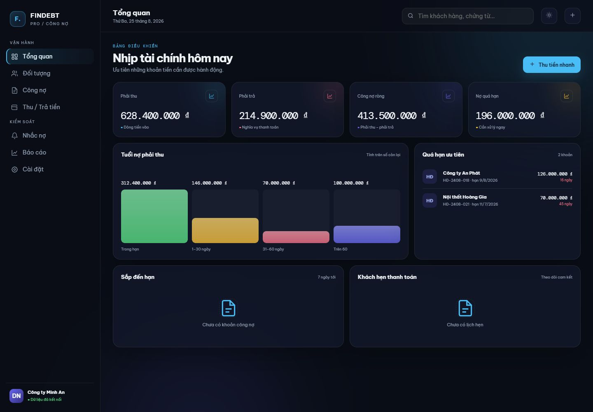

Dashboard hiển thị:

- **Phải thu:** tổng outstanding của chứng từ phải thu.
- **Phải trả:** tổng outstanding của chứng từ phải trả.
- **Công nợ ròng:** phải thu trừ phải trả.
- **Nợ quá hạn:** outstanding của các chứng từ đã qua hạn.
- **Tuổi nợ:** trong hạn, 1–30 ngày, 31–60 ngày và trên 60 ngày.
- **Quá hạn ưu tiên:** các khoản cần liên hệ trước.
- **Sắp đến hạn:** khoản đến hạn trong 7 ngày.
- **Khách hẹn thanh toán:** lời hẹn hôm nay, sắp tới hoặc đã trễ.

Mọi số liệu được tính phía máy chủ. Không nhập trạng thái thanh toán bằng tay.

## 3. Tạo khách hàng hoặc nhà cung cấp

Mở **Đối tượng** để tìm và quản lý khách hàng/NCC.

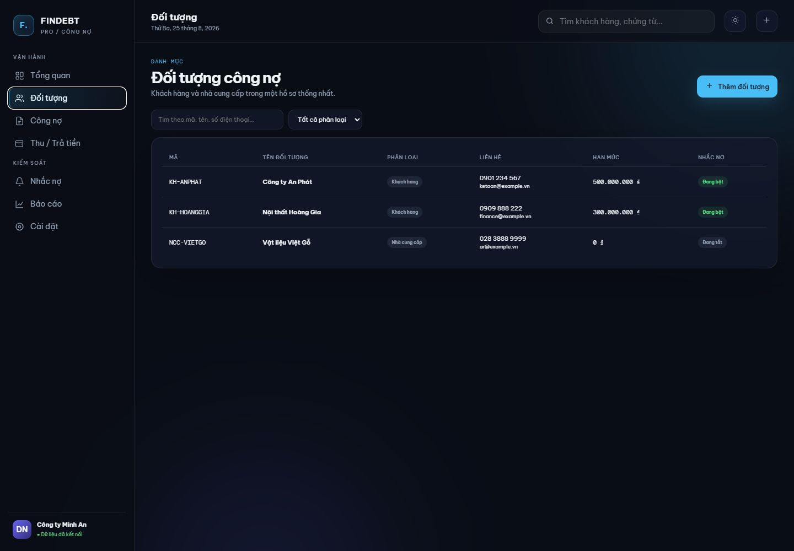

Chọn **Thêm đối tượng**, sau đó nhập:

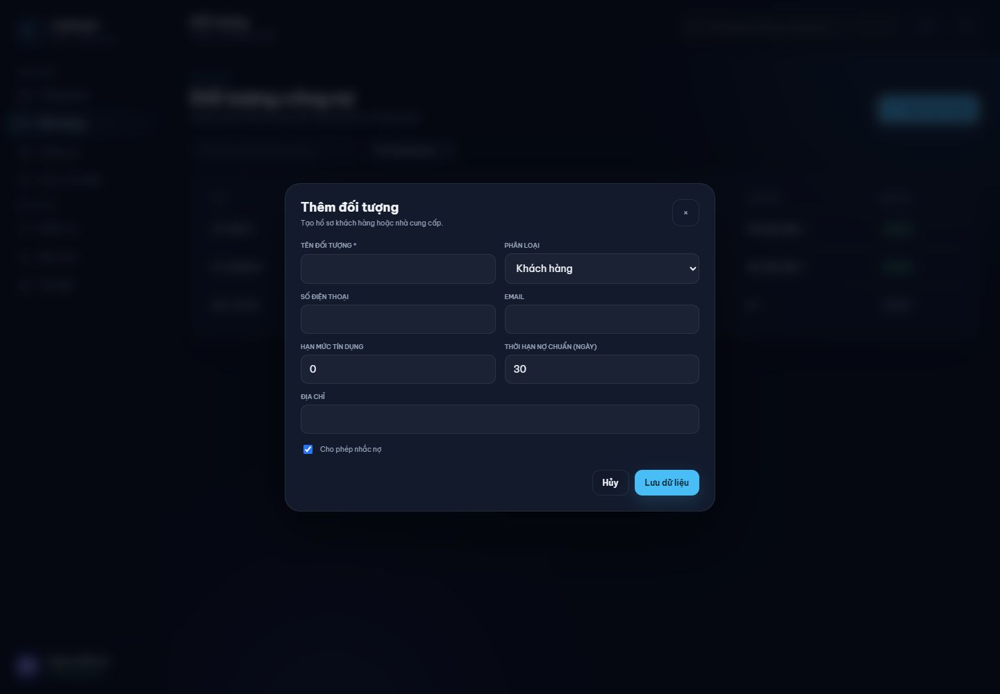

- Tên và phân loại khách hàng/NCC.
- Số điện thoại, email và địa chỉ.
- Hạn mức tín dụng đối với khách hàng.
- Thời hạn nợ chuẩn, ví dụ 30 ngày.
- Chỉ bật **Cho phép nhắc nợ** khi email đã được kiểm tra.

Nếu có số dư đầu kỳ, hệ thống tự tạo chứng từ `DAU-KY` để số dư tham gia dashboard, aging và thanh toán giống chứng từ bình thường.

## 4. Tạo chứng từ công nợ

Mở **Công nợ** để xem phải thu và phải trả.

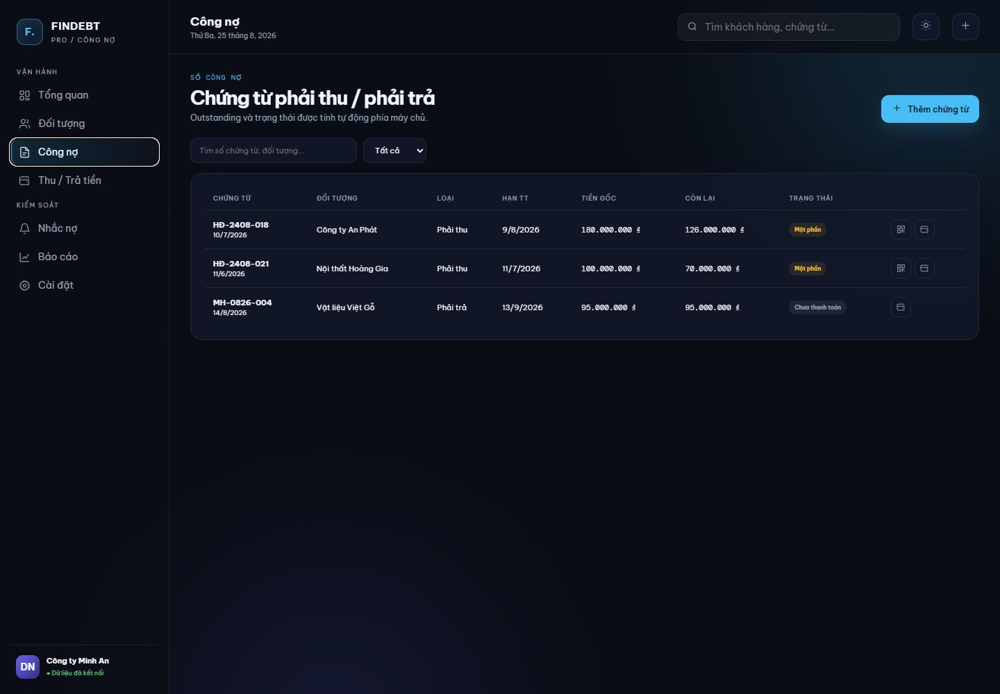

Chọn **Thêm chứng từ**:

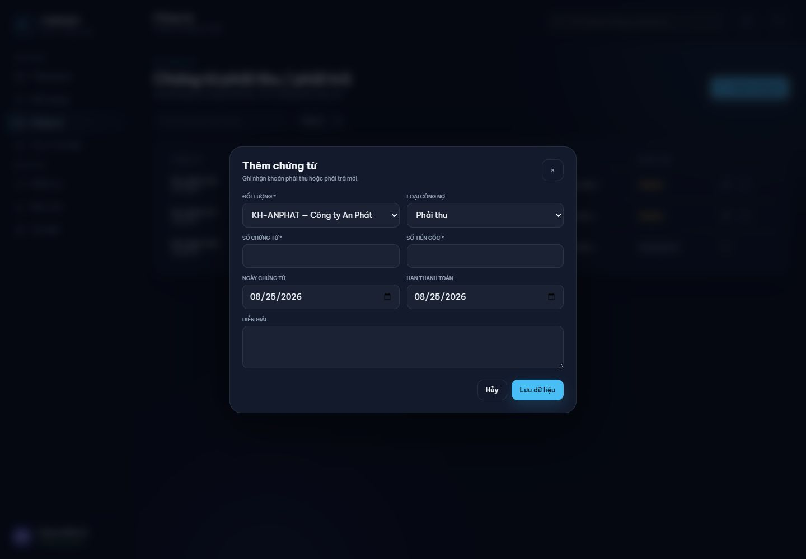

1. Chọn đối tượng.
2. Chọn **Phải thu** cho bán nợ hoặc **Phải trả** cho mua nợ/NCC.
3. Nhập số chứng từ và số tiền nguyên VND.
4. Nhập ngày chứng từ và hạn thanh toán.
5. Kiểm tra cảnh báo hạn mức trước khi tiếp tục giao dịch bán nợ.

Outstanding được tính theo công thức `Tiền gốc − Tổng thanh toán đã phân bổ còn hiệu lực`.

## 5. Ghi nhận thu hoặc trả tiền

Từ dòng chứng từ, chọn biểu tượng ví hoặc chọn **Thu tiền nhanh** trên Dashboard.

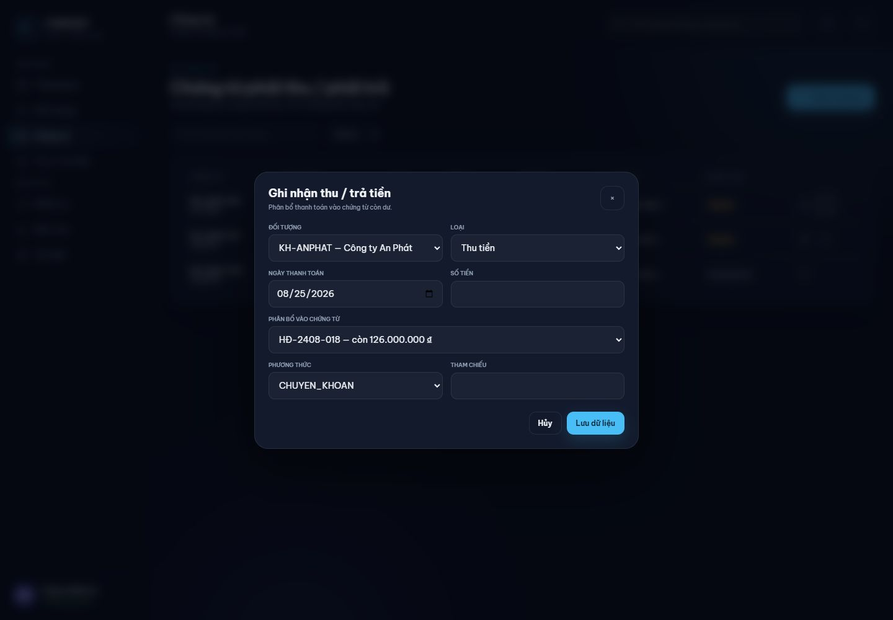

1. Chọn thu tiền hoặc trả tiền NCC.
2. Nhập ngày, số tiền, phương thức và tham chiếu ngân hàng.
3. Chọn chứng từ cần phân bổ.
4. Kiểm tra số tiền không vượt outstanding.
5. Lưu giao dịch.

Một chứng từ có thể nhận nhiều lần thanh toán. Backend cũng hỗ trợ một khoản thanh toán phân bổ cho nhiều chứng từ. Không xóa trực tiếp giao dịch tài chính; dùng **Void/Hủy** để audit log vẫn giữ lịch sử.

Ví dụ kiểm tra chuẩn:

- Hóa đơn: 100.000.000₫.
- Thu lần một: 30.000.000₫.
- Outstanding mới: 70.000.000₫.
- Thu tiếp: 70.000.000₫.
- Outstanding bằng 0, trạng thái chuyển thành **Đã thanh toán** và dừng aging/reminder/VietQR.

## 6. Thu tiền bằng VietQR

Với chứng từ phải thu còn dư, chọn biểu tượng QR trên dòng chứng từ. QR luôn lấy **outstanding mới nhất**, không dùng lại giá trị hóa đơn ban đầu.

Nội dung chuyển khoản có dạng `FIN {Mã đối tượng} {Mã chứng từ}`. Sau khi nhận tiền, kế toán vẫn phải ghi nhận thanh toán và phân bổ để đóng công nợ.

## 7. Nhắc nợ và lời hẹn thanh toán

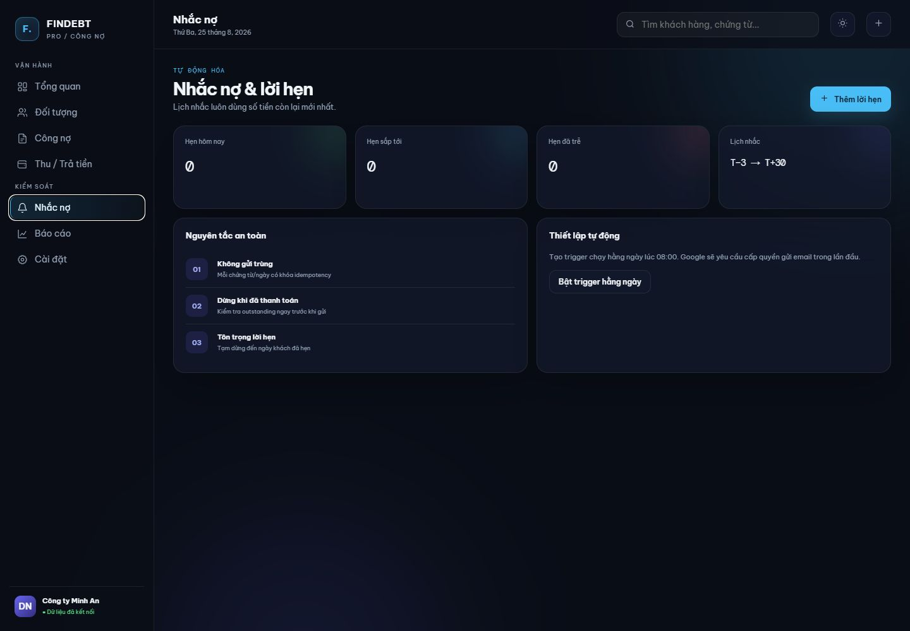

Lịch mặc định: T−3, T, T+3, T+7, T+14, T+30, sau đó 7 ngày/lần. Hệ thống kiểm tra lại outstanding ngay trước khi gửi và không gửi nếu:

- Công nợ đã thanh toán đủ.
- Reminder key đã được gửi.
- Khách đang có Promise to Pay chưa đến hạn.
- Đối tượng tắt nhắc nợ hoặc không có email.

Khi khách cam kết thanh toán, chọn **Thêm lời hẹn**, nhập ngày/số tiền và chứng từ. Dashboard sẽ phân loại hẹn hôm nay, sắp tới hoặc đã trễ.

Trong giai đoạn nhập dữ liệu thử, để trống email hoặc tắt **Cho phép nhắc nợ** nhằm tránh gửi email thật.

## 8. Báo cáo, PDF, import/export và backup

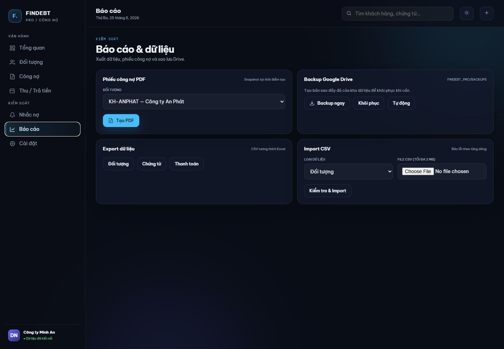

- **PDF công nợ:** chọn đối tượng rồi tạo phiếu snapshot tại thời điểm hiện tại.
- **Export CSV:** xuất đối tượng, chứng từ hoặc thanh toán; file có BOM để Excel đọc tiếng Việt.
- **Import CSV:** chọn loại dữ liệu và file tối đa 2 MB. Hệ thống validate trước khi ghi và trả lỗi theo từng dòng.
- **Backup ngay:** tạo bản sao Google Sheet trong `FINDEBT_PRO/BACKUPS`.
- **Khôi phục:** luôn tạo thêm bản `BEFORE_RESTORE` trước khi ghi đè dữ liệu hiện tại.

Không khôi phục backup khi người khác đang nhập giao dịch. Nên thực hiện ngoài giờ và kiểm tra lại tổng phải thu/phải trả ngay sau restore.

## 9. Cấu hình tài khoản ngân hàng

Mở **Cài đặt** để xem trạng thái doanh nghiệp và danh sách tài khoản VietQR.

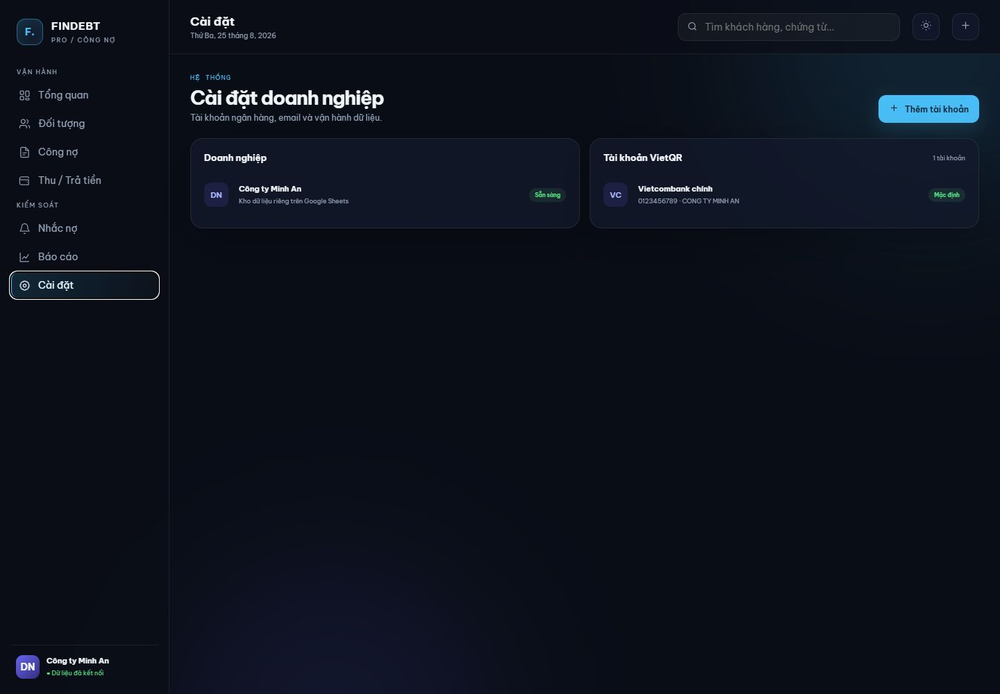

Chọn **Thêm tài khoản**:

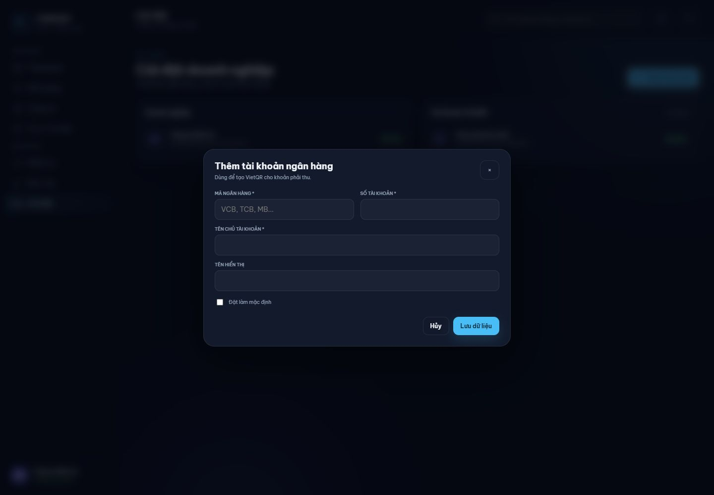

Nhập mã ngân hàng, số tài khoản, tên chủ tài khoản và tên hiển thị. Đánh dấu **Mặc định** cho tài khoản dùng khi chứng từ không chỉ định tài khoản riêng. Hãy quét thử QR với số tiền nhỏ trước khi sử dụng thực tế.

## 10. Sử dụng trên điện thoại

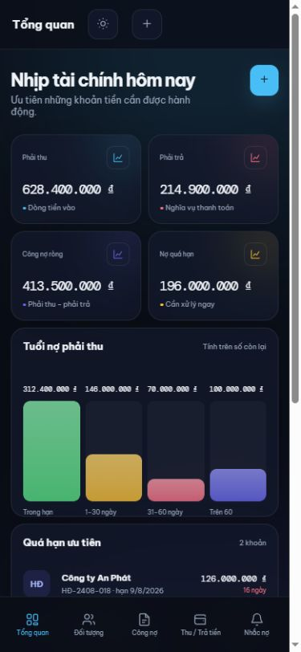

Mobile có bottom navigation dành riêng cho Tổng quan, Đối tượng, Công nợ, Thu/Trả tiền và Nhắc nợ. Ưu tiên trên điện thoại:

1. Xem khoản quá hạn.
2. Tìm khách hàng/chứng từ.
3. Mở VietQR khi khách thanh toán tại chỗ.
4. Ghi nhận thu tiền ngay sau khi ngân hàng báo có.
5. Kiểm tra lời hẹn và lịch sử nhắc nợ.

## 11. Checklist cuối ngày cho kế toán

1. Đối chiếu các khoản ngân hàng báo có với thanh toán đã ghi nhận.
2. Kiểm tra thanh toán chưa phân bổ hết.
3. Xem nợ quá hạn và Promise to Pay đã trễ.
4. Xác nhận email khách hàng trước khi bật nhắc nợ.
5. Kiểm tra backup gần nhất.
6. Không sửa/xóa trực tiếp dòng tài chính trong Google Sheet.

## 12. Xử lý sự cố nhanh

- **Không tìm thấy trang:** dùng profile chỉ đăng nhập một Google account.
- **Authorization required:** chọn đúng tài khoản và cấp đủ quyền.
- **VietQR không xuất hiện:** kiểm tra đây là phải thu, outstanding lớn hơn 0 và đã có tài khoản ngân hàng.
- **Không gửi email:** kiểm tra email, cờ cho phép nhắc nợ, outstanding, Promise to Pay và Apps Script executions.
- **Số liệu không đúng:** kiểm tra phân bổ, giao dịch void và ngày/hạn thanh toán; không sửa trạng thái bằng tay.
- **Import lỗi:** giữ nguyên header mẫu và sửa từng dòng theo thông báo lỗi.

Xem thêm [Hướng dẫn quản trị triển khai](ADMIN_GUIDE.md) và [Quy tắc thanh toán](PAYMENTS.md).
